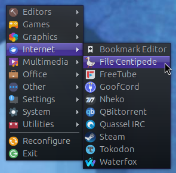
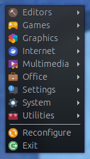
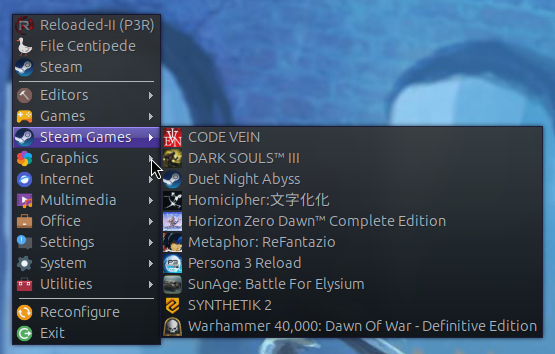
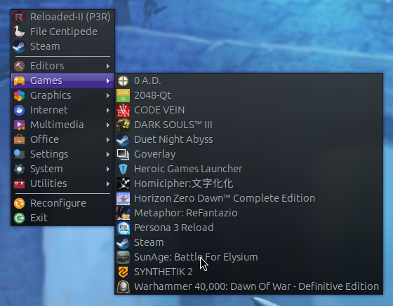
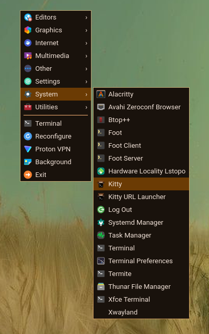
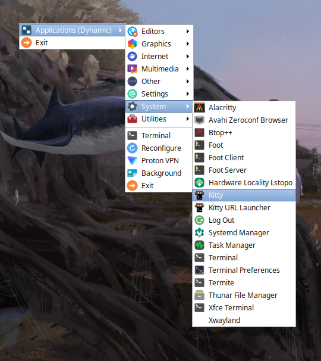
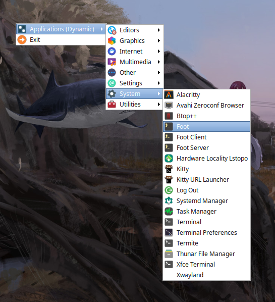

# Labwc/Openbox Menu Generator

## Features

- **Dual Mode**: Generate static XML menus or dynamic piped menus (Openbox).
- **Robust Icon Detection**: Automatically finds the best icon by reading the GTK icon theme from `~/.config/gtk-3.0/settings.ini`.
- **Pretty Formatting**: Outputs clean static XML.
- **Custom Footer**: Supports a customizable footer with dynamic icons and separators.
- **Auto-Reconfigure**: Can automatically reconfigure Labwc after generating the menu.

## Usage

### Generate Static Menu
```bash
python3 menu-generator.py -o ~/.config/labwc/menu.xml
```

### Disable Footer
```bash
python3 menu-generator.py -o ~/.config/labwc/menu.xml --no-footer
```

### Add Desktop Icons in ~/Desktop to Menu
```bash
python3 menu-generator.py -o ~/.config/labwc/menu.xml [--desktop-root | --desktop-groups]
```

|--desktop-root|--desktop-groups|default|
|-|-|-|
| <br/> desktop icons show above everything else| <br/> desktop icons are included in the application categories| <br/> desktop icons are not included|

### Separate Steam Games Into Their Own Category
```bash
python3 menu-generator.py -o ~/.config/labwc/menu.xml --separate-steam-games
```

|--separate-steam-games|default|
|-|-|
| <br/> Steam games are in their own category| <br/> Steam games are included alongside game launchers like Heroic, and utilities like Goverlay|

## Preview

### Labwc (Static Menu)

| | |
|-|-|
|||

### Openbox (Piped Menu)

| | |
|-|-|
|||

`menu.xml` for the openbox menu shown above
```
<?xml version="1.0" encoding="UTF-8"?>
<openbox_menu>
    <menu id="root-menu" label="Root Menu">
        <menu id="apps-menu"
              label="Applications (Dynamic)"
              icon="/usr/share/icons/Papirus/48x48/categories/applications-all.svg"
              execute="python3 /path/to/menu-generator.py" /> <!-- Edit this line -->
<!-- menu without footer: "python3 /path/to/menu-generator.py -f false" -->

        <item label="Exit" icon="/usr/share/icons/Tela/32/status/system-log-out.svg">
            <action name="Exit"/>
        </item>
    <item label="Terminal" icon="" execute="xfce4-terminal">
    </item>
    </menu>
</openbox_menu>
```

## Configuration

1. Edit the `footer_items` list in the script to customize menu footer entries with your preferred applications and icons.
2. Edit `terminal_string` to set your preferred terminal emulator.

## Credits

Original work by [onuronsekiz](https://github.com/onuronsekiz/obamenu/)
